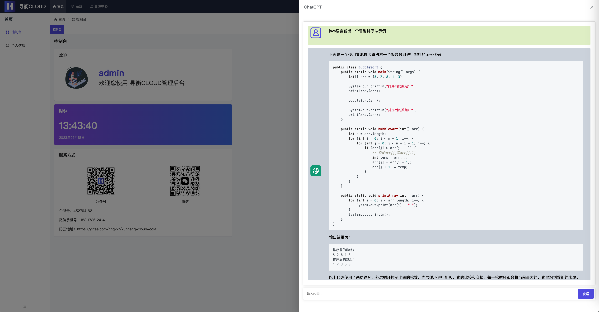

# xunheng-cloud-cola(寻衡微服务COLA架构后台管理框架)

##  :tada: 2.0版本更新。如果帮助到了你，可以给个小星星⭐️,共同进步。 :tada:
### 更新简介(包括但不限于：)
1.升级了springcloud alibaba(2022.0.0.0)以及springboot(3.0.2)的版本

2.相关依赖升级，代码优化，更新模板，更新pom archetype，jdk版本目前最低为17

3.接口文档变更为openapi3规范，引入knife4j

4.删除了plumelog变更为tlog

## 介绍
寻衡cloud是应用阿里开源的**COLA4.0**架构配合**springcloud-alibaba**+**satoken**+**mybatisplus**+**elasticsearch**+**quartz**+**tlog**等搭建的后台管理系统框架。并且开发了相关基础服务与示例服务(如chatgpt,微信公众号)

### 前言
本项目使用java语言开发，依赖COLA4.0架构实现，适合已经掌握或者想通过本项目来参考学习springcloud alibaba微服务组件与COLA架构的小伙伴们使用与开发。

### 关于COLA4.0
开源平台使用COLA4.0架构的管理后台不多，所以想用这种架构来实现，COLA只是提供了多一种选择，不代表这是唯一的使用方式，你可以选择某些服务使用COLA，某些服务使用MVC，符合自己或自己团队适合的模式更重要。

[COLA4.0](https://github.com/alibaba/COLA)是阿里开源的一款应用架构，很多思想来自于DDD(领域驱动模型)，但相对于DDD来说更加简化清晰。熟悉MVC结构开发的人来说第一次看到会有种摸不着头脑的感觉，所以在使用本框架前，可以对[COLA4.0](https://github.com/alibaba/COLA)进行一些基本的学习。

使用COLA会让项目更加清晰，符合高内聚低耦合的思想，但COLA也存在缺点，比如由于层数增多，在架构中会增加很多实体的转换，dto的数量相较MVC模式会大大增加，但在现在各种工具的帮助下都可以简化操作。还比如有的业务代码考虑在哪一层实现会感觉比较模糊，需要通过不断的实践获得更深的认知。

**对于代码量增多的问题，项目已经集成了cola架构的maven archetype骨架还有mvc与cola两种架构的代码生成器，同时包括前端vue项目的代码生成，简化开发。**

### 模块介绍
| 模块名称                         | 简介                                                       |
|------------------------------|----------------------------------------------------------|
| xunheng-cloud-cola-archetype | cola架构模块的模板骨架，方便直接创建项目模块，配合代码生成器简化开发                     |
| xunheng-core                 | 项目核心包，包括公共依赖与组件配置                                        |
| xunheng-auth                 | springcloud-gateway网关服务，同时处理用户鉴权，认证框架使用的Sa-Token         |
| xunheng-system               | 管理系统服务，包含登录，用户，角色，组织结构，权限等等                              |
| xunheng-quartz               | 计划任务服务，对job计划经行配置/执行                                     |
| xunheng-log                  | 日志服务，系统的操作日志，目前采用es存储                                    |
| xunheng-generator            | 代码生成器服务，包含了cola架构与mvc架构两种模式，简化开发。                        |
| xunheng-file                 | 资源中心服务，目前包括资源路径/上传配置/文件库等                                |
| xunheng-chatgpt              | chatgpt服务，依赖chatpgt-sdk，采用websocket创建链接，如需使用请在配置里填写token |
| xunheng-wechat               | 管理微信公众号与相关登录，推送等接口，由于时间问题前端页面未完全完成，可自行根据样例实现             |

### 开发环境与依赖版本
| java | mysql | mybatisplus   | cola |
|------|-------|---------------|------|
| 17   | 5.7   | 3.5.4.1 | 4.3.2      | 

| springcloud-alibaba | spring-cloud | spring-boot | nacos | seata | sentinel |
|---------------------|------------|-------------|-------|-------|----------|
| 2022.0.0.0          | 2022.0.0 | 3.0.2       | 2.2.1 | 1.7.0 | 1.8.6    |

### 项目体验
项目体验地址(服务器原因暂停，后续恢复)：[点我体验](http://118.89.48.196:2800/)  

**未在体验项目部署代码生成器与chatgpt服务，如果需要可以下载项目在本地部署体验。**

体验账号：

            账号：体验账号2 密码：123456
        
            账号：体验账号3 密码：123456
        
            账号：体验账号4 密码：123456

### 功能截图
** chatgpt **

0. 个人中心

1. 用户管理

2. 组织架构管理

3. 角色权限管理

4. 菜单权限管理

5. 计划任务管理

6. 数据字典管理

7. 拓展配置管理

8. 矩阵管理

9. 平台租户管理
10. 操作日志

11. 会话监控
12. 前后端代码生成器

13. 文件配置

14. 文件库

### 前端项目
前端项目请访问另一个仓库[xunheng-cloud-cola-front](https://gitee.com/hhqkkr/xunheng-cloud-cola-front).基于scui开发，使用的elementplus+vue3

### 安装教程
1.  搭建基本的SpringCloud Alibaba环境(注意上方的软件版本，包括部署nacos，配置seata)。
2.  在nacos中新建命名空间【xhcc】将项目中的nacos文件夹里的yml配置文件导入到xhcc命名空间下。
3.  将项目中几个服务的mysql文件导入到数据库。
4.  修改yml配置文件的参数，比如数据库地址用户名密码，redis地址与密码等等。
5.  在项目中修改每个服务的bootstrap.yml文件。改成nacos所在的地址，如果用的是自己的命名空间，则需要修改其中的namespace与group
6.  启动auth服务与system服务后可以成功登陆与使用。其他的服务按需启动。
7.  启动前端项目，访问前端地址即可使用。超级管理员账号admin 密码123456

### 使用说明
    一些使用的细节会在下方说明，后续会考虑写一下完整使用教程
1.  #### 如何开发自己的服务
    *如果你想使用常用的mvc架构，那直接功能新建子模块，然后在代码生成器生成相关的mvc架构代码就行。

    *如果你想使用cola架构，因为cola架构是多模块并且目录多，新建很麻烦，所以在目录下有xunheng-cloud-cola-archetype的项目骨架，你可以将它install到本地仓库或者deploy到远程仓库后，通过这个archetype生成cola项目。

    archetype中有两个需要填写的自定义的参数【serviceName】【serviceUppercaseName】对应的是服务的名称与首字母大写的名称。例：你想创建message服务，artifactId为xunheng-message。这两个参数则填写【message】【Message】
2.  #### 菜单功能权限
    本系统的菜单功能权限是基于RBAC模型。层级为菜单 -> 功能组 -> 功能
    
    配置权限的最细粒度选择到功能组。比如在用户管理菜单，配置了【基础维护】【维护密码】两个功能组。 【基础维护】功能组包括了增删改查等api的功能。【维护密码】功能组包括了密码重置api的功能

    功能可以理解为一个api，每个api有一个权限码，对应后端controller的每一个方法,注解为@permissionCode。每次访问都会根据这个注解的aop进行权限控制

    **由于是多租户的系统，不需要配置权限的功能也需要加上这个注解才能进行基本的租户过滤，@permissionCode('none')**
 
3.  #### 数据权限
    目前开源的数据权限为一种方式，即数据等级。包括全平台，本租户，本分公司，本部门，本人。同时可以选择是否包含下级。

## 后续开发计划
   因为基本功能相对完善，后续以修复bug为主，如有好的建议，请提交issue，感谢。

## 关于
  欢迎各位开发者尝试使用本项目进行开发或学习，可以联系我进行更多的探讨，后续根据人数会考虑建群。

  如果有其他开发需求与合作，可以QQ【452794162】微信【15817362414】

  之所以叫【寻衡】，是意为追寻一种平衡。我们在设计一个功能的时候，并不是做到最完整就是最好的。得根据客户的需求，产品的定位，人员的能力等等去选择一种平衡。生活中做出的任何选择也是如此。

